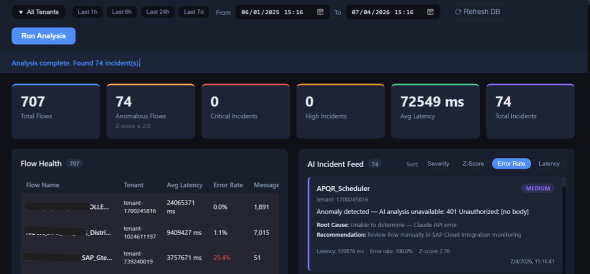

# ⚡ IntegrationIQ

> AI-powered health monitoring for SAP Cloud Integration — powered by InfluxDB, Claude AI, and a real-time React dashboard.

---

## Screenshot

<!-- Replace the line below with your actual screenshot -->


---

## Overview

IntegrationIQ continuously monitors your SAP Cloud Integration (CPI) message processing by reading raw telemetry from InfluxDB, running statistical anomaly detection, and calling the Claude AI API to generate human-readable incident explanations — all surfaced on a live React dashboard via WebSocket.

```
InfluxDB (CPI metrics)
       │
       ▼
 Spring Boot Backend
  ├─ Z-score anomaly detection
  ├─ Claude AI analysis (per anomalous flow)
  ├─ PostgreSQL (incident storage)
  └─ WebSocket push
       │
       ▼
  React Dashboard
  ├─ Metric cards
  ├─ Flow health table
  ├─ AI incident feed  (sort by severity / Z-score / error rate / latency)
  └─ Latency bar chart
```

---

## Features

| Feature | Detail |
|---|---|
| **Live analysis** | Trigger analysis for any time window; progress streams to the dashboard in real time |
| **Anomaly detection** | Z-score on avg latency + error rate per flow; composite score flags outliers |
| **AI incident feed** | Claude generates summary, root cause, severity, and recommended action per anomalous flow |
| **Tenant filter** | Multi-select dropdown with Select All; filters all panels simultaneously |
| **Incident sorting** | Sort the feed by Severity, Z-Score, Error Rate, or Latency |
| **Quick time ranges** | One-click Last 1h / 6h / 24h / 7d buttons |
| **Refresh DB** | Wipe all stored incidents and start fresh with one click |
| **Tenant privacy** | `TENANT_ANONYMISE=true` hashes names before storage or AI calls; set `false` on org machines |

---

## Tech Stack

| Layer | Technology |
|---|---|
| Backend | Java 17, Spring Boot 3, Maven |
| Frontend | React 18, TypeScript, Vite, Recharts |
| Time-series DB | InfluxDB 2.x (external, bucket: `cpi`) |
| Relational DB | PostgreSQL 16 (Docker) |
| AI | Anthropic Claude (`claude-sonnet-4-20250514`) |
| Realtime | STOMP over SockJS (WebSocket) |
| Container | Docker + Docker Compose |

---

## Prerequisites

- [Docker Desktop](https://www.docker.com/products/docker-desktop/) running
- InfluxDB 2.x already running with a `cpi` bucket populated
- An [Anthropic API key](https://console.anthropic.com/)

---

## Quick Start

### 1. Clone

```bash
git clone https://github.com/AMAN-LADWA/integrationiq.git
cd integrationiq
```

### 2. Configure

```bash
cp .env.example .env
```

Edit `.env`:

```env
# InfluxDB — must be reachable from inside Docker
INFLUX_URL=http://host.docker.internal:8086
INFLUX_TOKEN=your-influxdb-token-here
INFLUX_ORG=your-org-name
INFLUX_BUCKET=cpi

# Anthropic
ANTHROPIC_API_KEY=sk-ant-...

# PostgreSQL (Docker manages this)
POSTGRES_USER=iiq
POSTGRES_PASSWORD=iiq_secret

# Set to false to show real tenant names (org machines)
TENANT_ANONYMISE=false
```

> **Finding your InfluxDB org:** Open `http://localhost:8086` → click your avatar (top-left) → the org name is shown under your profile.
>
> **Token format:** paste the raw token — no quotes.

### 3. Run

```bash
docker compose up --build
```

| Service | URL |
|---|---|
| Dashboard | http://localhost:3000 |
| Backend API | http://localhost:8080 |

---

## Running an Analysis

### From the Dashboard

1. Open `http://localhost:3000`
2. Use the **Last 1h / 6h / 24h / 7d** quick buttons or pick a custom date range
3. Click **Run Analysis** — progress updates stream in real time

### From the Command Line

```bash
# Last 24 hours (default)
node trigger-analysis.js

# Custom window
node trigger-analysis.js 2024-06-01T00:00:00Z 2024-06-02T00:00:00Z

# Against a remote instance
IIQ_URL=http://your-server:8080 node trigger-analysis.js
```

---

## InfluxDB Schema

IntegrationIQ expects the following schema in the `cpi` bucket:

| Type | Key | Values |
|---|---|---|
| Tag | `IntegrationFlowName` | name of the iFlow |
| Tag | `Tenant` | tenant identifier |
| Tag | `Status` | `completed` `failed` `escalated` `abandoned` `discarded` `cancelled` `processing` |
| Field | `value` | message processing time in ms |

---

## API Reference

| Method | Endpoint | Description |
|---|---|---|
| `POST` | `/api/analyse/trigger?from=<ISO>&to=<ISO>` | Trigger analysis for a time window |
| `GET` | `/api/incidents` | Fetch the 50 most recent incidents |
| `DELETE` | `/api/incidents` | Delete all stored incidents (Refresh DB) |
| `GET` | `/api/health` | Health check |

---

## Configuration Reference

All configuration is via environment variables. No secrets are hardcoded.

| Variable | Default | Description |
|---|---|---|
| `INFLUX_URL` | — | InfluxDB base URL |
| `INFLUX_TOKEN` | — | InfluxDB API token |
| `INFLUX_ORG` | — | InfluxDB organisation name |
| `INFLUX_BUCKET` | `cpi` | InfluxDB bucket name |
| `ANTHROPIC_API_KEY` | — | Anthropic API key |
| `POSTGRES_USER` | `iiq` | PostgreSQL username |
| `POSTGRES_PASSWORD` | `iiq_secret` | PostgreSQL password |
| `TENANT_ANONYMISE` | `true` | Hash tenant names before storage/AI calls |

---

## Project Structure

```
integrationiq/
├── backend/
│   ├── Dockerfile
│   ├── pom.xml
│   └── src/main/java/com/integrationiq/
│       ├── config/          AppConfig, WebSocketConfig, CorsConfig
│       ├── controller/      AnalysisController
│       ├── model/           FlowMetric, Incident, AnalysisUpdate
│       ├── repository/      IncidentRepository
│       └── service/
│           ├── InfluxQueryService       — Flux queries, result mapping
│           ├── AnomalyDetectionService  — Z-score on latency + error rate
│           ├── ClaudeService            — Anthropic API call + fallback
│           ├── TenantAnonymiser         — Configurable name masking
│           └── AnalysisOrchestrator     — Async pipeline + WS broadcast
├── frontend/
│   ├── Dockerfile + nginx.conf
│   └── src/
│       ├── components/
│       │   ├── MetricCards.tsx
│       │   ├── FlowHealthList.tsx
│       │   ├── IncidentFeed.tsx
│       │   ├── LatencyChart.tsx
│       │   └── TenantFilter.tsx
│       ├── hooks/useWebSocket.ts
│       ├── api/index.ts
│       └── types/index.ts
├── docker-compose.yml
├── trigger-analysis.js
└── .env.example
```

---

## Adding a Screenshot

1. Take a screenshot of the running dashboard
2. Save it as `docs/screenshot.png` in the repo root
3. It will automatically appear at the top of this README

---

## License

MIT
